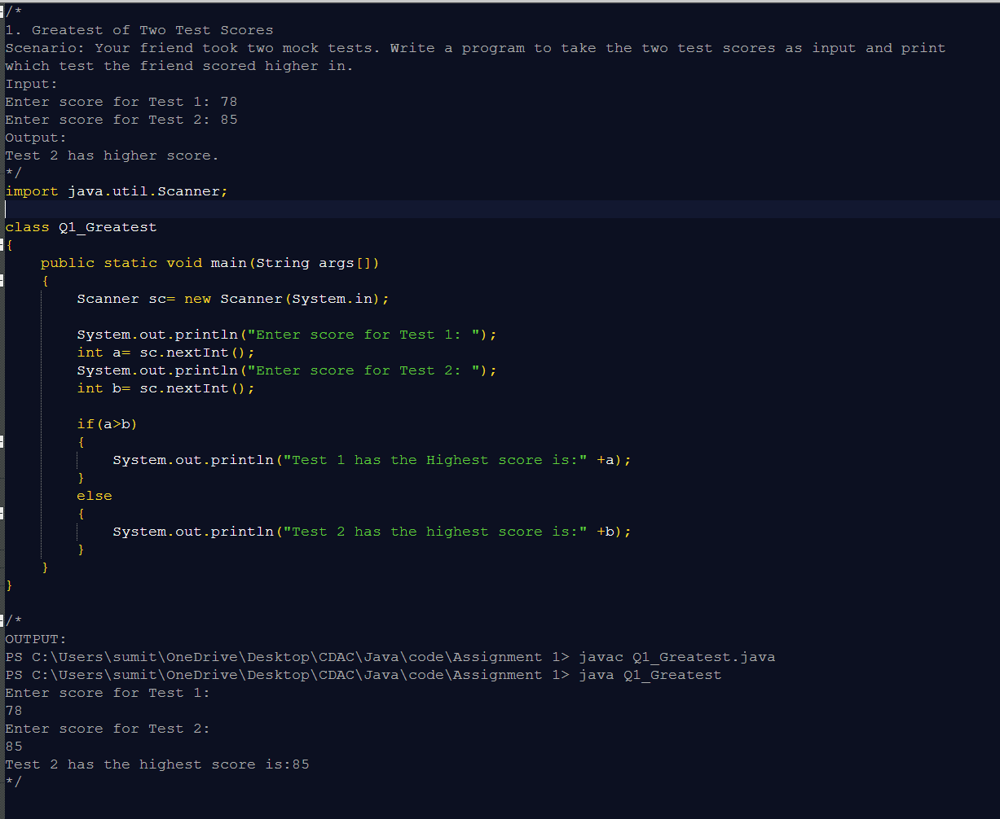

# Java-50-Coding-Questions

As part of my **CDAC (Diploma in Advanced Computing)** journey, I have been learning the fundamentals of Java.  
This repository contains solutions to **50 Java coding questions** that I solved as **Assignment 1**.

Each file follows this structure:
- The **problem statement** is written at the top as a comment.  
- The **solution code** comes next.  
- The **expected output** is included at the end in comments.  

---

## 📘 Topics Covered

These 50 problems focus on **basic Java programming and logic building**:  

### 🔹 Beginner-Level Logic
- Check Even or Odd numbers  
- Vowel or Consonant  
- Character Type Checker (alphabet, digit, special symbol)  
- Divisibility checks (e.g., divisible by 5, 11, etc.)  
- Reverse digits of a number  
- Lucky number problems  
- Days in a month (including leap year check)  

### 🔹 Intermediate-Level Logic
- Grading system with symbols (A+, B, C, etc.)  
- Leap year + days validation  
- Mark's evaluation & pass/fail check  
- Bonus calculation programs  
- Armstrong numbers, sum of digits, etc.
  
---

## 🚀 How to Run

1. Clone the repository:
   ```bash
   git clone https://github.com/<sumitpmote>/Java-50-Coding-Questions.git

## 🖼️ Sample Code Screenshot

Q1_Greater – Problem Statement, Code & Output:




